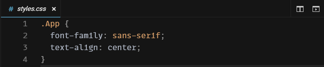

# JavaScript와 React

JavaScript는 웹페이지를 만들기 위해서는 필수라고 볼 수 있는 언어예요. 프로젝트를 되돌아보면서 JavaScript, 그리고 React와 친숙해져봐요.

## App.js 살펴보기

### 1번 줄

`./styles.css`를 가져와 적용해요. `./styles.css`와 같은 경로가 정확히 어디를 가리키는지에 대해서는 [부록 C: 공통 컴퓨터 지식](appendix-c-common-computer-knowledge.md#경로)를 살펴보세요.

CSS는 앞서 설명한 태그들로 골격을 잡아둔 웹사이트에 색이나 테두리같은 걸 꾸며주는 역할을 해요. 하지만 아무 태그나 꾸미면 안되니까 원하는 태그만 꾸미기 위해서 선택자selector를 통해 꾸밀 대상을 선택하지요.

`import`가 뭔지는 아래에 적어둘테니 쭉 읽어보세요.

### 3번 줄

아무 것도 받지 않는 `App`이라는 함수를 만들어요.

함수는 0개 이상의 값 묶음을 받아서 하나의 값을 돌려주는 코드 뭉치에요. 여기서 특히 하나의 속성 객체를 받고 태그를 돌려주는 App 같은 함수를 컴포넌트라고 부르는데 (실제로는 조건이 더 있지만 나중에 알아볼게요!), 이런 컴포넌트들은 `<h1>` 같은 태그 쓰듯이 쓸 수 있어요.

`export default`가 뭔지는 아래에 적어둘테니 쭉 읽어보세요.

#### 4번 줄

이 함수, App의 실행 결과로 괄호 안의 값을 보내요. 컴포넌트를 만들다보면 태그가 길어지는 일이 자주 발생하기 때문에 보통 return 뒤에 괄호가 오기 쉽지만 괄호는 선택이에요! 이 안에 있는 것들을 보낸다는 걸 잘 보여주기 위해 쓰는 거에요.

#### 5번 줄 ~ 10번 줄

앞서 설명했듯이, 태그를 통해 웹페이지 구조를 나타내요.

## 모듈

원래 컴퓨터는 그냥 계산기였지만 컴퓨터가 점점 더 복잡해지고, 커져만 가서 더 이상 파일 한두개로 관리할 수 없게 됐어요.

그래서 사람들은 파일을 나누고, 내가 이 파일의 어디를 쓴다라는 걸 나타내기 위해서 모듈이라는 체계를 만들었어요. `export`를 통해 이 파일이 어떠어떠한 기능을 내보여서 쓸 수 있게 해준다고 하면, `import`를 통해서 그 기능을 가져다가 쓰는 거지요. 여기서 특히 `export default`로 내보낸 것은 `default` 라는 이름으로 내보내지는데, `import A from 'B';`를 쓸 때 가져와져요.

## styles.css 살펴보기

`.App`을 통해 `className`이 `"App"`인 것들을 선택해서, 폰트 패밀리font-family를 브라우저 기본 산세리프 폰트sans-serif로 설정해요. 텍스트 정렬text-align은 가운데center로 하네요.

이 책에서 CSS는 필요한 경우가 아니라면 추가적으로 언급하지 않을 생각이에요. 더 예쁜 웹사이트를 만들고 싶다면 [부록 D: 자주 쓰이는 스타일들](appendix-d-mostly-used-styles.md)을 살펴보세요.

## 살펴보지 않을 파일들

### index.js

index.js는 저희 웹사이트의 진입점에 해당해요. 여기선 웹사이트를 구성하는 기본 요소를 설정해주는 곳이라 이 책에서는 건드리지 않을 생각이에요.

### package.json

package.json에는 의존성과 개발자에 대한 정보 따위가 들어가는데, 저희는 이걸 수정할 동기가 없거니와 CodeSandbox가 의존성 검색 및 추가를 지원하므로 직접 건드리지 않을 생각이에요.

### public/index.html

index.html은 웹사이트의 기반이 되는 HTML 파일이에요. 여기를 건들지 않으면 신경쓰지 않고 기본 템플릿으로 만든 티가 나지만 그런 게 별로 중요하다고 생각하지는 않기 때문에 이 책에서 다루지는 않을 거에요.
