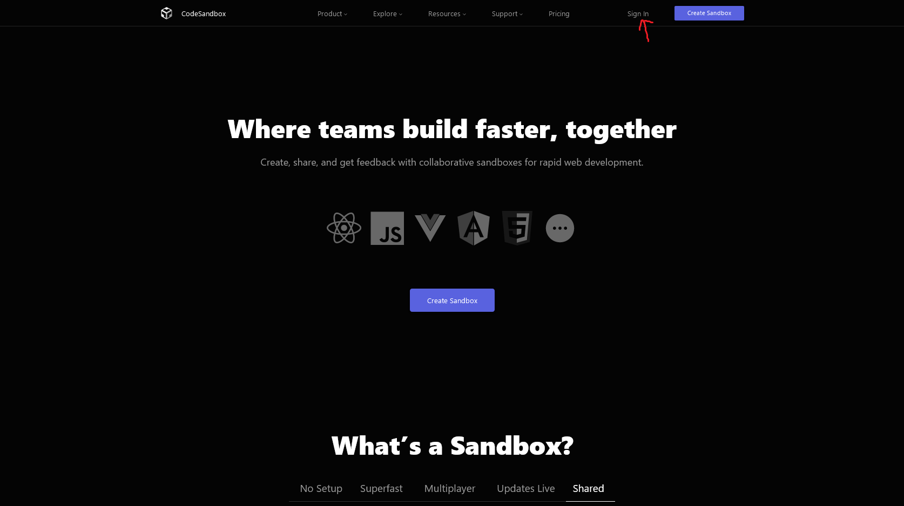
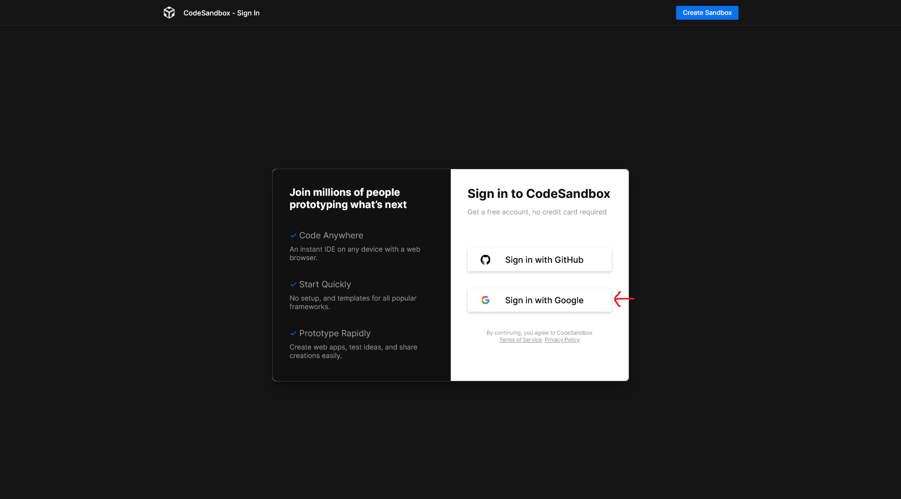
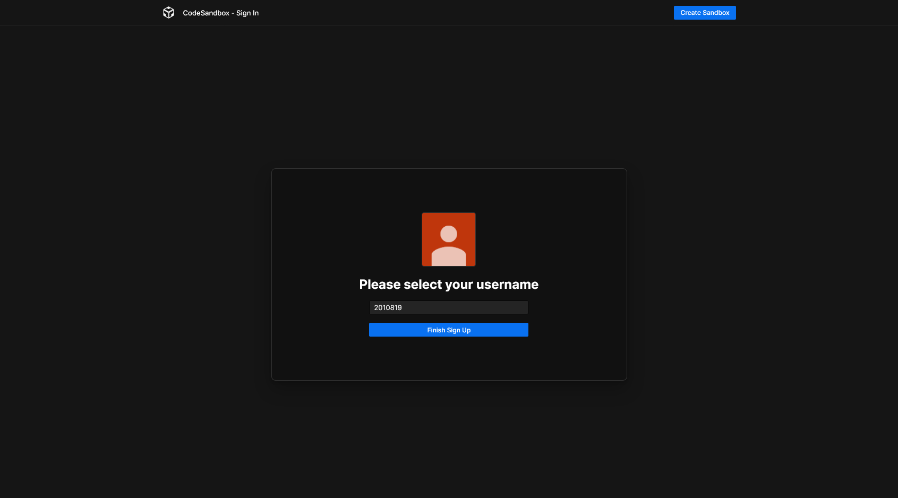
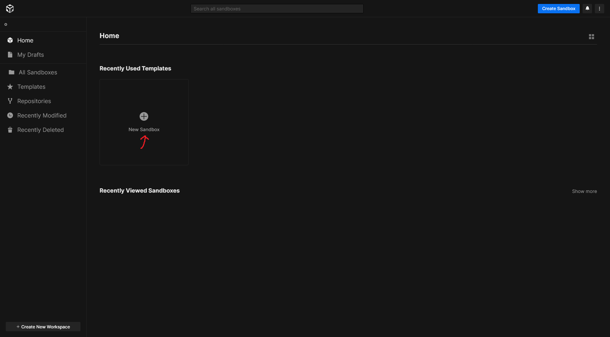
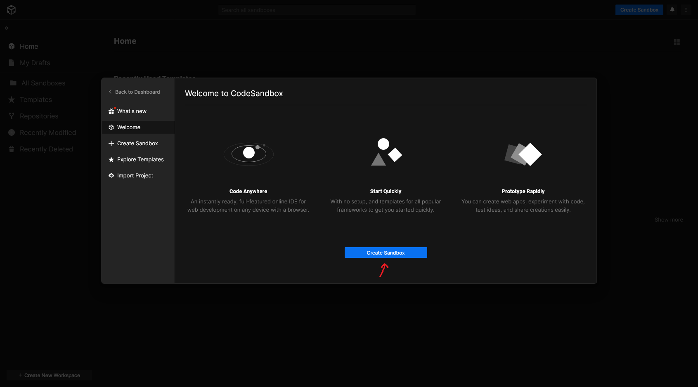
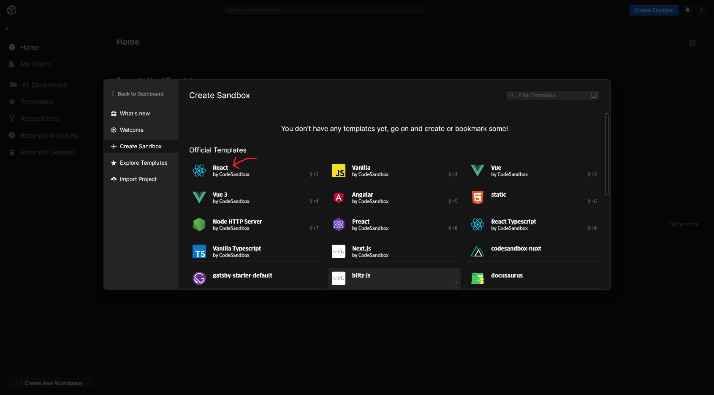
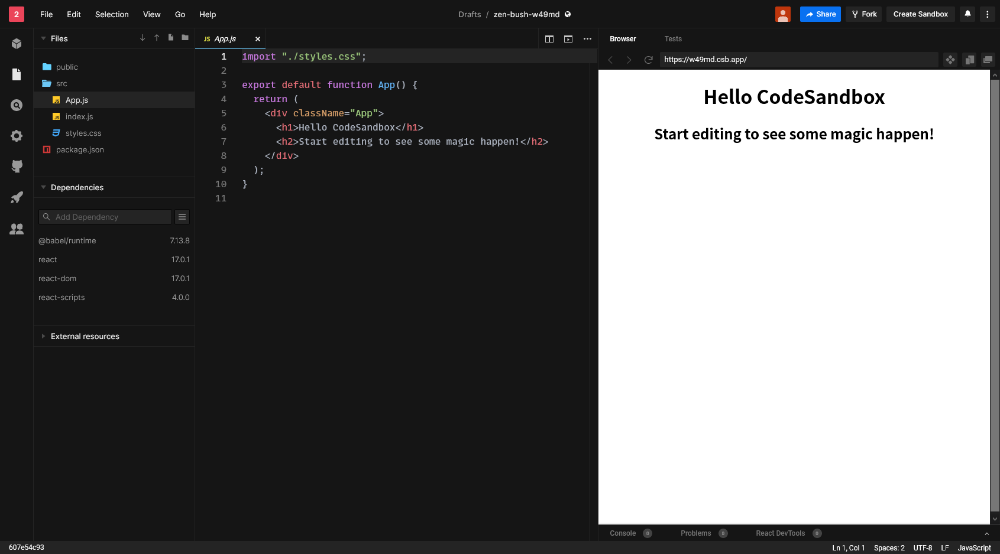
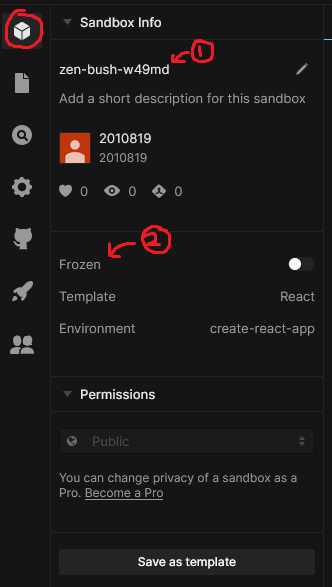
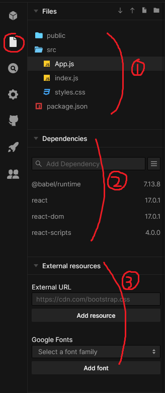
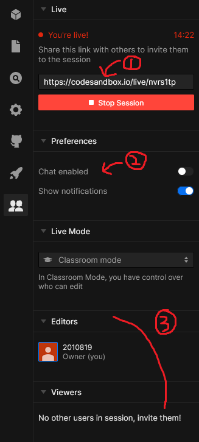

# 프로젝트를 시작하며

자, 그럼 웹사이트를 한 번 만들어보자구요. 그런데, 어디에서부터 시작해야 할까요? 다양한 방법이 있겠지만, 여기서는 여러분이 웹 프로젝트를 쉽게 만들고 공유할 수 있는 웹사이트를 하나를 소개시켜드릴게요.

## CodeSandbox

CodeSandbox는 복잡한 설정 없이도 시작할 수 있게 미리 설정해둔 환경을 빌려줘요. 용량 제한 같은 게 있기는 하지만, 이 책에서 가르치는 과제를 수행하는 데에는 부족함 없이 쓸 수 있을 거예요.

### 들어가기

먼저 [CodeSandbox](https://codesandbox.io/)에 접속해, 위쪽의 Sign In을 눌러요.

Sign in with Google을 눌러 자신의 계정으로 들어가요.

(첫 가입이라면) 이름을 설정해요.

### 다른 방법은 없나요?

이 책은 웹 프론트엔드 프로그래밍을 간단하게 다루기 때문에 CodeSandbox를 사용해요. 하지만, 기능에 다소 부족함이 있는 것은 사실이에요. 다른 환경을 원한다면 [부록 A: 개발 환경](appendix-a-development-environment.md)에서 다양한 개발 환경에 대해 더 자세히 알아보세요.

## 첫 프로젝트 만들기

이제 진짜로 프로젝트를 만들어봐요! 대시보드에서 New Sandbox를 클릭해요.

팝업이 하나 뜨는데, Create Sandbox를 눌러주세요.

다양한 템플릿이 떠요. 우리는 그 중에서 React를 선택하기로 해요.

우와! 신기한 것들이 생겨났어요. 코드를 알아보기에 앞서, 도구부터 사용법을 익혀보자구요.

## 둘러보기

왼쪽 사이드바에서 첫번째 큐브 아이콘을 눌러봤어요. 1번은 샌드박스의 이름이고, 2번은 샌드박스를 더 편집할 수 있는지, 아니면 이 상태로 고정해둘 건지예요.

두번재 파일 아이콘을 눌러봤어요. 1번은 샌드박스에서 내가 관리하는 파일들이고, 2번은 남이 공유해둔 코드를 가져오는 기능이에요. 3번은 사이트 바깥에서 가져오는 추가 리소스인 스타일시트와 폰트예요.

세번째 검색 아이콘은 누가 봐도 샌드박스 내부에서 검색을 하는 것 같죠?

네번째 기어 아이콘은 몇몇 설정을 할 수 있는 모양입니다만, 저희는 추가 설정 없이 진행하기로 해요.

다섯번째 고양이 아이콘에서는 GitHub과 연동, 여섯번째 로켓 아이콘에서는 Vercel과 Netlify와 연동할 수 있게 해줘요. 하지만 저희는 CodeSandbox만을 이용하기로 했으니 넘기기로 해요. 만약 관심이 있다면 [부록 B: 서비스](appendix-b-services.md)를 살펴보세요.

마지막 일곱번째 사람 아이콘을 눌러봤어요. 1번은 현재 자신이 코딩하고 있는 걸 라이브로 공유할 수 있는 링크이고, 2번은 채팅을 허용할지 여부이고, 3번은 수정이 가능한 사람과 그렇지 않은 사람을 나누고, 관리할 수 있는 패널이에요.

둘러본 결과, 저희는 큐브, 파일, 사람 아이콘만 잘 사용하면 될 것 같아요.
